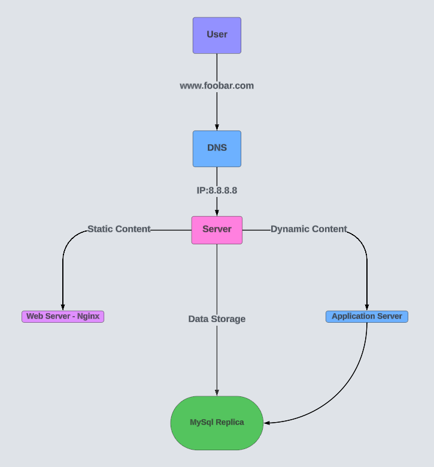

# One-Server Web Infrastructure for <www.foobar.com>

## One-Server Web Infrastructure

## Infrastructure Diagram

## User Access Flow

When a user wants to access [www.foobar.com](http://www.foobar.com):

1. User types [www.foobar.com](http://www.foobar.com) into their web browser.
2. User's computer sends a DNS query to resolve [www.foobar.com](http://www.foobar.com).
3. DNS server returns the IP address 8.8.8.8.
4. User's browser sends an HTTP request to 8.8.8.8.
5. Nginx receives and processes the request.
6. Application server executes necessary code, potentially interacting with MySQL.
7. Server sends back an HTTP response.
8. User's browser renders the received web page.

### Infrastructure Components

### 1. Server (IP: 8.8.8.8)

A single machine hosting all components of the web application.

### 2. Domain Name ([foobar.com](http://foobar.com))

Human-readable address for the website. The www record in [www.foobar.com](http://www.foobar.com) is typically a CNAME record pointing to the domain's A record.

### 3. Web Server (Nginx)

Handles HTTP requests, serves static content, and acts as a reverse proxy for dynamic content.

### 4. Application Server

Executes the business logic, processes dynamic content requests, and interacts with the database.

### 5. Application Files

The actual code base of the website/application.

### 6. Database (MySQL)

Stores and manages the website's data.

## Communication Protocol

The server communicates with the user's computer using HTTP over the internet.

## Limitations of This Infrastructure

### 1. Single Point of Failure (SPOF)

All components are on a single server. If it fails, the entire website becomes inaccessible.

### 2. Maintenance Downtime

Any maintenance requiring a server restart will result in website downtime.

### 3. Scalability Issues

This setup cannot handle large amounts of incoming traffic effectively. It lacks the ability to distribute load across multiple servers
