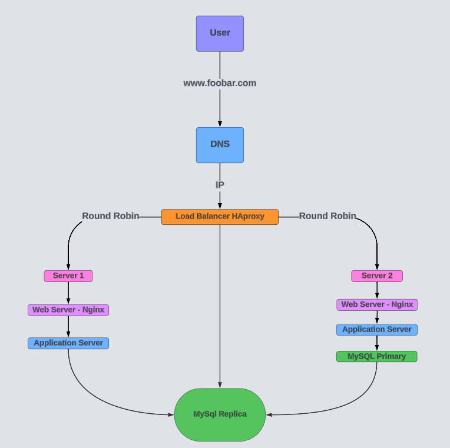

# Distributed Web Infrastructure for <www.foobar.com>

**Infrastructure Diagram**

USER ACCESS FLOW

Imagine a user wants to access the website <www.foobar.com>. Here's what happens:

    - The user types [www.foobar.com](http://www.foobar.com) into their web browser.
    - The user's computer sends a DNS query to resolve [www.foobar.com](http://www.foobar.com).
    - The DNS server returns the IP address of the load balancer.
    - The user's browser sends an HTTP request to the load balancer's IP address.
    - The load balancer distributes the request to one of the two servers.
    - The web server (Nginx) on the selected server receives the request.
    - Nginx processes the request, potentially passing it to the application
    - The application server executes the necessary code, possibly interacting with the MySQL database (either Primary or Replica).
    - The server sends back an HTTP response to the user's browser via the load balancer.
    - The user's browser renders the received web page.

## Infrastructure Components

## 1. Servers (2)

These are computers or systems that provide resources, data, services, or programs to other computers, known as clients, over a network. In this case, we have two servers to distribute the load and provide redundancy.

## 2. Load Balancer (HAproxy)

The load balancer distributes incoming network traffic across multiple servers to ensure no single server becomes overwhelmed. It improves the distribution of workloads across multiple computing resources.

## 3. Web Server (Nginx)

The web server handles HTTP requests from clients. It serves static content directly and acts as a reverse proxy for dynamic content, forwarding requests to the application server.

## 4. Application Server

The application server executes the business logic of the web application. It processes dynamic content requests, interacts with the database, and generates responses.

## 5. Application Files

This is the actual code base of the website/application, typically written in languages like PHP, Python, or Ruby.

## 6. Database (MySQL)

The database stores and manages the website's data. It's set up in a Primary-Replica (Master-Slave) cluster for data redundancy and improved read performance.

## User Access Flow

Imagine a user wants to access the website <www.foobar.com>. Here's what happens:

    - The user types [www.foobar.com](http://www.foobar.com) into their web browser.
    - The user's computer sends a DNS query to resolve [www.foobar.com](http://www.foobar.com).
    - The DNS server returns the IP address of the load balancer.
    - The user's browser sends an HTTP request to the load balancer's IP address.
    - The load balancer distributes the request to one of the two servers.
    - The web server (Nginx) on the selected server receives the request.
    - Nginx processes the request, potentially passing it to the application
    - The application server executes the necessary code, possibly interacting with the MySQL database (either Primary or Replica).
    - The server sends back an HTTP response to the user's browser via the load balancer.
    - The user's browser renders the received web page.

## Communication Protocol

The servers communicate with the user's computer using the HTTP (Hypertext Transfer Protocol) over the internet.

## Infrastructure Infrastructure

### Load Balancer Configuration

The HAproxy is configured with a Round Robin distribution algorithm. It works by cycling through the list of servers, sending each new request to the next server in line.

### Active-Active vs Active-Passive Setup

This load-balancer enables an Active-Active setup. In Active-Active, all servers are running simultaneously and serving requests. In contrast, an Active-Passive setup would have one server actively serving requests while the other remains on standby.

### Database Primary-Replica Cluster

In this setup, the Primary node handles write operations and replicates data to the Replica node. The Replica node can handle read operations, improving read performance and providing data redundancy.

### Primary vs Replica Node

The Primary node handles write operations and is the authoritative source of data. The Replica node receives copies of the data from the Primary and can handle read operations, reducing load on the Primary.

## Limitations of This Infrastructure

### 1. Single Points of Failure (SPOF)

- Load Balancer: If it fails, the entire system becomes inaccessible.
- MySQL Primary Node: If it fails before replication, data loss may occur.

### 2. Security Issues

- No firewall: The system is vulnerable to unauthorized access and attacks.
- No HTTPS: Data transmitted between the user and the servers is not encrypted.

### 3. No Monitoring

- Without monitoring, it's difficult to identify and respond to issues promptly, potentially leading to extended downtime or performance problems.
