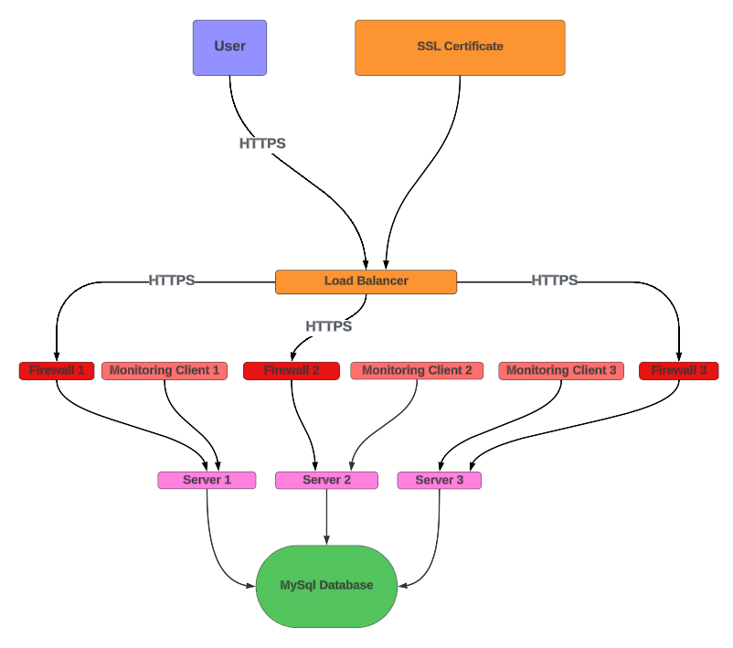

# Three-Server Web Infrastructure for <www.foobar.com>

## Infrastructure Diagram

## User Access Flow

Imagine a user wants to access the website <www.foobar.com>. Here's what happens:

    - The user types [www.foobar.com](http://www.foobar.com) into their web browser.
    - The user's computer sends a DNS query to resolve [www.foobar.com](http://www.foobar.com).
    - The DNS server returns the IP address of the load balancer.
    - The user's browser sends an HTTPS request to the load balancer's IP address.
    - The load balancer distributes the request to one of the three servers.
    - The web server (Nginx) on the selected server receives the request.
    - Nginx processes the request, potentially passing it to the application server.
    - The application server executes the necessary code, possibly interacting with the MySQL database.
    - The server sends back an HTTPS response to the user's browser via the load balancer.
    - The user's browser renders the received web page.

## Infrastructure Components

### 1. Servers (3)

Three identical servers, each containing a web server (e.g., Nginx), application server, and a monitoring client.

### 2. Load Balancer

Distributes incoming traffic across the three servers to ensure high availability and improved performance.

### 3. Firewalls (3)

One firewall for each server to control incoming and outgoing network traffic, enhancing security.

### 4. SSL Certificate

Enables HTTPS for encrypted communication between users and the website.

### 5. MySQL Database

Centralized database for storing and managing website data.

### 6. Monitoring Clients (3)

One on each server to collect performance and health data.

## Specifics of the Infrastructure

### Additional Elements

- Firewalls: Added to protect each server from unauthorized access and potential threats.
- SSL Certificate: Enables HTTPS to encrypt data in transit, protecting user information and ensuring data integrity.
- Monitoring Clients: Allow for real-time tracking of server performance, resource utilization, and potential issues.

### Firewall Purpose

Firewalls act as a barrier between trusted internal networks and untrusted external networks, controlling and monitoring incoming and outgoing network traffic based on predetermined security rules.

### HTTPS Traffic

HTTPS is used to encrypt communication between users and the website, preventing eavesdropping, tampering, and man-in-the-middle attacks. It also builds trust with users by showing that the site is secure.

### Monitoring Purpose

Monitoring is used to track server health, performance metrics, resource utilization, and application behavior. It helps in identifying issues, optimizing performance, and ensuring high availability.

### Monitoring Data Collection

Monitoring clients collect data by:

1. Reading system logs
2. Tracking resource usage (CPU, memory, disk I/O)
3. Measuring response times and request rates
4. Checking for specific events or errors

This data is then sent to a centralized monitoring service for analysis and alerting.

### Monitoring Web Server QPS

To monitor Queries Per Second (QPS):

1. Configure the monitoring client to track incoming HTTP requests
2. Set up a metric for counting requests over time intervals (e.g., per second)
3. Create a dashboard or alert to visualize and track this metric
4. Optionally, set up alerts for when QPS exceeds certain thresholds

## Infrastructure Issues

### SSL Termination at Load Balancer

Terminating SSL at the load balancer can be an issue because:

1. Traffic between the load balancer and servers is unencrypted, potentially exposing data within the internal network
2. It doesn't support end-to-end encryption
3. Compliance requirements might necessitate encryption throughout the entire infrastructure

### Single MySQL Server for Writes

Having only one MySQL server for write operations is problematic because:

1. It creates a single point of failure for write operations
2. It can become a bottleneck during high write loads
3. Maintenance or failures can lead to write unavailability

### Identical Server Components

Having servers with identical components (database, web server, and application server) can be problematic because:

1. It doesn't allow for optimized resource allocation based on specific needs (e.g., database-heavy vs. application-heavy loads)
2. It can lead to inefficient use of resources
3. It doesn't provide the flexibility to scale individual components independently
4. A bug affecting one component could potentially impact the entire infrastructure
