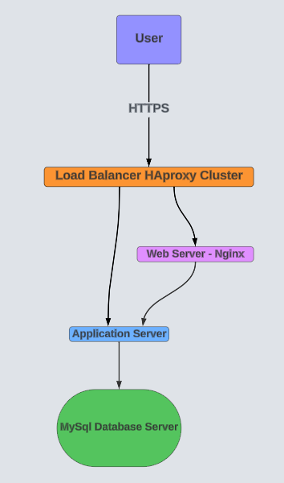

# Scaled-Up Web Infrastructure for www.foobar.com

## Infrastructure Diagram

## User Access Flow

- User types <www.foobar.com> in their browser and presses Enter.
- The browser performs a DNS lookup and sends an HTTPS request to the Load Balancer.
- The Load Balancer (HAproxy cluster) handles the incoming HTTPS request.
- It decrypts (if SSL termination is set at the Load Balancer) and distributes the request to the Web Server.
- The Web Server (Nginx) handles the HTTP request and serves static content.
- For dynamic content, it forwards the request to the Application Server.
- The Application Server processes dynamic requests, executing application logic.
- If data is needed, it queries the Database Server.
- The Database Server (MySQL) processes read or write queries and returns the results to the Application Server.
- The Application Server compiles the response and sends it back to the Web Server.
- The Web Server forwards the final response through the Load Balancer to the user.
- Monitoring tools track performance metrics across all servers for optimal operation and troubleshooting.

## Infrastructure Components

### 1. Servers (3)

Three separate servers, each dedicated to a specific component: web server, application server, and database.

### 2. Load Balancer (HAproxy)

Configured as a cluster with another load balancer for high availability and to distribute incoming traffic.

### 3. Web Server

Dedicated server running Nginx to handle HTTP requests and serve static content.

### 4. Application Server

Dedicated server to run the application code and process dynamic content requests.

### 5. Database Server

Dedicated server running MySQL to store and manage the website's data.

## Specifics of the Infrastructure

### Additional Server

Added to separate concerns and allow for independent scaling of components. This improves performance and maintainability.

### Load Balancer (HAproxy)

Added to distribute traffic evenly across servers, improve reliability, and enable horizontal scaling. Configured as a cluster for high availability.

### Split Components

Web server, application server, and database each have their own server. This allows for:

- Independent scaling based on specific needs
- Improved security through isolation
- Better resource allocation and performance optimization
- Easier maintenance and updates
